# Projeto SQL - Análise do E-commerce Brasileiro (Olist)

## Conjunto de Dados Público - Kaggle

Este projeto utiliza o [Conjunto de dados públicos de comércio eletrônico brasileiro da Olist](https://www.kaggle.com/datasets/olistbr/brazilian-ecommerce), disponível no Kaggle.

O dataset reúne informações de pedidos realizados entre 2016 e 2018 em diversos marketplaces no Brasil, incluindo dados de:

* Pedidos (orders)
* Itens vendidos (order_items)
* Clientes (customers)
* Vendedores (sellers)
* Produtos (products)
* Avaliações de clientes (reviews)
* Pagamentos (payments)

No total, são 100 mil pedidos, com tabelas que permitem análises completas de comportamento de clientes, desempenho logístico e performance de vendas.

## Objetivo do Projeto

Construir e popular um banco de dados relacional no MySQL a partir dos arquivos CSV. Executar queries exploratórias para entender a estrutura dos dados.
Com a base estudada criar-se consultas analíticas para responder perguntas de negócio, como:
* Quais categorias tiveram a maior e menor quantidade vendida?
* Quais categorias tiveram a maior e menor quantidade vendida em Curitiba?
* Quais categorias tiveram o menor tempo de recompra?
* Qual o ticket médio, máximo e mínimo dos pedidos?
* Quanto tempo em média leva para um pedido ser entregue?
* Quanto tempo em média leva para um pedido ser entregue por categoria?
* Qual é a taxa de atraso na entrega?

## Tecnologias Utilizadas no Projeto

* MySQL 8.0 → criação do banco de dados, modelagem das tabelas e consultas SQL (exploratórias e analíticas).
* MySQL Workbench → interface gráfica para administração do banco, execução de queries e carga inicial dos dados.
* Kaggle → fonte do dataset público [Conjunto de dados públicos de comércio eletrônico brasileiro da Olist](https://www.kaggle.com/datasets/olistbr/brazilian-ecommerce).
* Visual Studio Code → criação de documentos comprobatórios de criação, iportação e análise de dados.
* Git & GitHub → versionamento do projeto e publicação do portfólio.
* Power BI/Tableau → visualização de dashboards.

# Início no MySQL

Para conseguir fazer as análises e queries no MySQL, precisamos realizar o load do dataset da Olist. Porém, antes de iniciar o carregamento dos arquivos CSVs precisamos criar o local que iremos armazenar-los(Banco de Dados).

## 1 - Criação da Database 

Nesta etapa criei o banco de dados `olist_data`, que será usado para armazenar todas as tabelas importadas do dataset da Olist.
Usei o UTF-8, pois ele suporta uma grande quantidade de caracteres internacionais e emojis, ele nada mais é que uma codificação de caracteres Unicode que armazena a maioria dos caracteres de diversas línguas e símbolos, sendo a codificação recomendada para bancos de dados SQL.

O comando abaixo cria o banco de dados com suporte e caracteres UTF-8:
```sql
-- 1) Criação da data base
CREATE DATABASE IF NOT EXISTS olist_data
  CHARACTER SET utf8mb4 COLLATE utf8mb4_0900_ai_ci;
USE olist_data;
```
## 2 - Criação das Tabelas e Importaçãos dos CSVs

Precisamos criar as tabelas que iremos importar da nossa base de dados disponibilizada pelo Kaggle, no nosso MySQL Workbench. Vou descrever duas criações abaixo, as demais deixei como histórico de produção na pasta Script com o código completo de criação e importação das tabelas: [create_tables.sql](scripts/create_tables.sql)

### 2.1 - Tabelas Utilizadas no Projeto

Foram utilizados 9 arquivos CSVs do dataset da Olist, cada um representando uma entidade no banco de dados relacional:

| Arquivo CSV                           | Tabela no MySQL                     | Descrição                                                    |
|---------------------------------------|-------------------------------------|--------------------------------------------------------------|
| `olist_customers_dataset.csv`         | `olist_customers`                   | Dados dos clientes (ID, CEP, cidade, estado).                |
| `olist_geolocation_dataset.csv`       | `olist_geolocation`                 | Coordenadas geográficas associadas a CEPs.                   |
| `olist_order_items_dataset.csv`       | `olist_order_items`                 | Itens dos pedidos: produto, vendedor, preço, frete.          |
| `olist_order_payments_dataset.csv`    | `olist_order_payments`              | Pagamentos: método, número de parcelas, valor.               |
| `olist_order_reviews_dataset.csv`     | `olist_order_reviews`               | Avaliações dos pedidos: nota, comentário, datas.             |
| `olist_orders_dataset.csv`            | `olist_orders`                      | Pedidos: datas de compra, aprovação, envio, entrega, status. |
| `olist_products_dataset.csv`          | `olist_products`                    | Produtos: categoria, peso, dimensões.                        |
| `olist_sellers_dataset.csv`           | `olist_sellers`                     | Vendedores: ID, CEP, estado.                                 |
| `product_category_name_translation.csv` | `product_category_name_translation` | Tradução de categorias de produtos (pt → en).                |


### 2.2 Criação da Tabela e Importação do CSV - `olist_customers`
A tabela `olist_customers` contém os dados básicos dos clientes, como identificador único, CEP, cidade e estado.  
Ela é importante para análises de localização, distribuição de pedidos e perfil de clientes.

```sql
USE olist_data;

CREATE TABLE olist_customers (
   customer_id              CHAR(32) NOT NULL,
   customer_unique_id       CHAR(32) NOT NULL,
   customer_zip_code_prefix VARCHAR(10) NOT NULL,
   customer_city            VARCHAR(100) NOT NULL,
   customer_state           CHAR(2) NOT NULL,
   PRIMARY KEY (customer_id)
);

```
Agora que criamos a tabela `olist_customers`, precisamos realizar o `LOAD DATA INFILE` e carregar os dados no esqueleto da tabela criada. Para não haver erros ou até para revalidar que estamos inserindo na tabela apenas os dadoscarregados da base, utilizamos o `TRUNCATE TABLE`, que basicamente ele irá apagar todos os dados que podem estar já estar armazenados, deixando apenas o esqueleto da tabela.

```sql
USE olist_data;

TRUNCATE TABLE olist_customers;

LOAD DATA INFILE 'C:/ProgramData/MySQL/MySQL Server 8.0/Uploads/archive/olist_customers_dataset.csv'
INTO TABLE olist_customers
CHARACTER SET utf8mb4
FIELDS TERMINATED BY ',' OPTIONALLY ENCLOSED BY '"'
ESCAPED BY '"'
LINES TERMINATED BY '\n' 
IGNORE 1 LINES
(customer_id, customer_unique_id, customer_zip_code_prefix, customer_city, customer_state);

```
Podemos realizar duas *queries* para confirmar; quantas linhas foram carregadas e outra, mostrando 10 linhas para visualizar se os dados foram inseridos corretamente em suas respectativas colunas, como a formatação.

Aqui solicitamos a contagem total de linhas inseridas na tabela.
```sql
SELECT COUNT(*) FROM olist_customers;
```

<p align="center">
  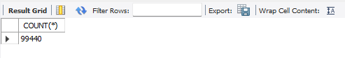
</p>

Agora, solicitamos as 10 primeiras linhas de toda a tabela.
```sql
SELECT COUNT(*) FROM olist_customers;
```

<p align="center">
  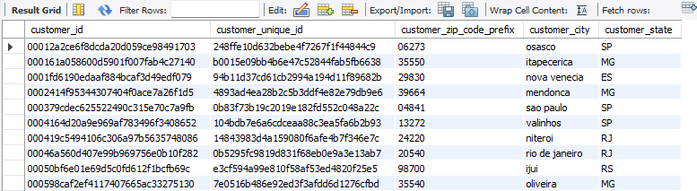
</p>

### 2.3 - Criação da Tabela e Importação do CSV - `olist_orders`
Na tabela `olist_orders`, o processo fugiu do padrão:
- O `LOAD DATA INFILE` precisou tratar campos de data, utilizando `NULLIF` para evitar erros em valores vazios.

Essa adaptação foi importante para:
- Manter a consistência referencial entre as tabelas.
- Garantir que valores obrigatórios estivessem devidamente preenchidos.
- Tratar corretamente dados nulos durante a importação.

Esse tipo de ajuste reflete a realidade de muitos projetos de dados, em que os datasets não estão 100% prontos para uso e exigem correções pontuais durante a modelagem.

```sql
CREATE TABLE olist_orders (
			 order_id VARCHAR(50) NOT NULL,
             customer_id VARCHAR(50) NOT NULL,
             order_status VARCHAR(30) NOT NULL,
             order_purchase_timestamp DATETIME NOT NULL,
             order_approved_at DATETIME NOT NULL,
             order_delivered_carrier_date DATETIME NOT NULL,
             order_delivered_customer_date DATETIME NOT NULL,
             order_estimated_delivery_date DATETIME NOT NULL,
             PRIMARY KEY(order_id,customer_id)
);

TRUNCATE TABLE olist_orders;

LOAD DATA INFILE 'C:/ProgramData/MySQL/MySQL Server 8.0/Uploads/archive/olist_orders_dataset.csv' 
INTO TABLE olist_orders
CHARACTER SET utf8mb4
FIELDS TERMINATED BY ',' OPTIONALLY ENCLOSED BY '"'
ESCAPED BY '"'
LINES TERMINATED BY '\n'
IGNORE 1 LINES
(order_id,customer_id,order_status,@order_purchase_timestamp,@order_approved_at,@order_delivered_carrier_date,@order_delivered_customer_date,@order_estimated_delivery_date)
SET 
 order_purchase_timestamp = NULLIF(@order_purchase_timestamp,''),
 order_approved_at = NULLIF(@order_approved_at,''),
 order_delivered_carrier_date = NULLIF(@order_delivered_carrier_date,''),
 order_delivered_customer_date = NULLIF(@order_delivered_customer_date,''),
 order_estimated_delivery_date = NULLIF(@order_estimated_delivery_date,'');
```
Realizando as *queries* para confirmar; quantas linhas foram carregadas e outra, mostrando 10 linhas para visualizar se os dados foram inseridos corretamente em suas respectativas colunas, como a formatação.

Aqui solicitamos a contagem total de linhas inseridas na tabela.
```sql
SELECT COUNT(*) FROM olist_orders;
```
<p align="center">
  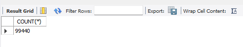
</p>

Agora, solicitamos as 10 primeiras linhas de toda a tabela.
```sql
SELECT COUNT(*) FROM olist_orders;
```

<p align="center">
  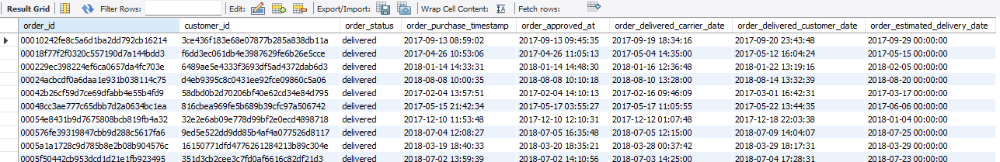
</p>

### Observações sobre Integridade Referencial

Durante a modelagem, tentei criar chaves estrangeiras (FKs) entre as tabelas para garantir integridade referencial.  
Porém, o dataset público da Olist possui linhas órfãs (ex.: `customer_id` presente em `olist_orders` mas ausente em `olist_customers`).  

Por esse motivo, não foi possível aplicar algumas FKs sem modificar os dados originais.  
Optei por não alterar os dados, para manter a fidelidade ao dataset original do Kaggle.  

No entanto, as relações lógicas entre as tabelas foram consideradas em todas as queries analíticas via `JOIN`.

# Queries Exploratórias 

## Quais categorias tiveram a maior e menor quantidade vendida?

### Análise Exploratória e Qualidade dos Dados

Ao realizar a query para responder "Quais categorias tiveram a maior e menor quantidade vendida?", identifiquei uma inconsistência entre as tabelas `olist_products` e `product_category_name_translation`.

- A tabela `olist_products` possui 74 categorias distintas.
- A tabela `product_category_name_translation` possui apenas 71 categorias distintas.

Isso significa que algumas categorias presentes em `olist_products` não têm correspondência na tabela de tradução.  
Esse tipo de discrepância é comum em datasets públicos e reforça a importância da etapa de análise exploratória antes da modelagem final.

Abaixo mostro como em uma `query` conseguimos validar os dados que existem na `olist_products`, e na `product_category_name_translation` esta como NULL.

```sql
SELECT DISTINCT op.product_category_name AS products,
				odp.product_category_name AS category
FROM olist_products op
LEFT JOIN olist_data.product_category odp
ON odp.product_category_name = op.product_category_name
WHERE odp.product_category_name IS NULL;
```
Abaixo verificamos que apenas dois dados estão sem o real complemento, sendo a primeira linha apenas uma diferença de formatação de dados, onde na `olist_products` o dado foi inserido como campo vazio (" "), e na `product_category_name_translation` o dado foi colocado como NULL.

<p align="center">
  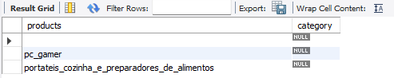
</p>

Para não descartar dados relevantes, optei por utilizar um LEFT JOIN partindo da `olist_products`.  
Dessa forma, todas as categorias são mantidas, e aquelas sem tradução aparecem como `NULL` ou "não identificadas".  

Esse tratamento garante consistência na análise, preserva os dados originais e ao mesmo tempo evidencia lacunas existentes no dataset público.

### Análise e Criação da Query

Para conseguir realizar a query onde mostre o `MAX` e, o `MIN` acompanhado da categoria, utilizei o recurso `WITH` (CTE – Common Table Expression).  
O `WITH` permite criar uma tabela temporária dentro da consulta (no caso, chamada `contagem_categoria`).  
Isso deixa a query mais organizada, evita repetição de código (subquery) e facilita reuso — em vez de escrever o mesmo `SELECT ... GROUP BY` duas vezes, defini uma vez na CTE e depois referenciei.

A lógica foi:
1. Criar a CTE `contagem_categoria` com o total de itens vendidos por categoria, tabela temporária,
2. Consultar essa CTE duas vezes: uma filtrando o máximo (`MAX`) e outra filtrando o mínimo (`MIN`),
3. Juntar os dois resultados em uma única saída usando `UNION`.

```sql
(WITH contagem_categoria AS (
SELECT op.product_category_name AS categoria,
       COUNT(oi.seller_id) AS contagem
FROM olist_products op
LEFT JOIN olist_order_items oi
ON oi.product_id = op.product_id
GROUP BY op.product_category_name
)
SELECT categoria,
       contagem
FROM contagem_categoria
WHERE contagem = (SELECT MAX(contagem) FROM contagem_categoria))
UNION
(WITH contagem_categoria AS (
SELECT op.product_category_name AS categoria,
       COUNT(oi.seller_id) AS contagem
FROM olist_products op
LEFT JOIN olist_order_items oi
ON oi.product_id = op.product_id
GROUP BY op.product_category_name
)
SELECT categoria,
       contagem
FROM contagem_categoria
WHERE contagem = (SELECT MIN(contagem) FROM contagem_categoria));
```
Rodando a query temos como resultado que entre 2016 e 2018, a categoria que mais vendeu e menos vendeu respectativamente:

<p align="center">
  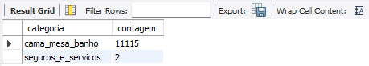
</p>

# Quais categorias tiveram a maior e menor quantidade vendida em Curitiba?

### Análise Exploratória e Qualidade dos Dados

Para responder essa pergunta, utilizei CTEs (WITH) para quebrar o problema em duas etapas:

1. CTE contagem → calcula, para cada categoria de produto, quantos pedidos distintos (COUNT(DISTINCT oi.order_id)) foram feitos por vendedores de Curitiba, considerando apenas pedidos entregues (o.order_status = 'delivered').
2. CTE extremos → obtém o valor mínimo e máximo de vendas (MIN e MAX) entre todas as categorias.
3. Query final → junta os dois resultados e, com a cláusula CASE, identifica se a categoria corresponde ao maior ou ao menor número de vendas.
   
```sql
WITH contagem AS (
  SELECT
    p.product_category_name AS categoria,
    COUNT(DISTINCT oi.order_id) AS contagem
  FROM olist_order_items oi
  JOIN olist_products     p  ON p.product_id  = oi.product_id
  JOIN olist_sellers      s  ON s.seller_id   = oi.seller_id
  JOIN olist_orders       o  ON o.order_id    = oi.order_id
  WHERE s.seller_city = 'curitiba'
    AND o.order_status = 'delivered'      
  GROUP BY p.product_category_name
),
extremos AS (
  SELECT MIN(contagem) AS min_c, MAX(contagem) AS max_c
  FROM contagem
)
SELECT 
  c.categoria,
  c.contagem,
  CASE 
    WHEN c.contagem = e.max_c THEN 'max'
    WHEN c.contagem = e.min_c THEN 'min'
  END AS tipo
FROM contagem c
INNER JOIN extremos e
ON c.contagem IN (e.min_c, e.max_c)
ORDER BY c.contagem DESC, c.categoria
```
Com isso verificamos que o resultado difere comparado ao geral das cidades do Brasil.

<p align="center">
  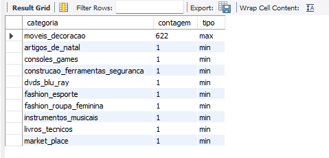
</p>

## Quais categorias tiveram o menor tempo de recompra?

### Análise Exploratória e Qualidade dos Dados (tentativa e achado)

### Método
- Montei uma base por `(cliente, categoria, pedido, data)` para assim evitar duplicações por múltiplos itens em um mesmo pedido (order_id).
  
```sql
SELECT DISTINCT o.customer_id,
				p.product_category_name AS categoria,
                o.order_id, o.order_purchase_timestamp AS dt
FROM olist_orders o
JOIN olist_order_items oi ON oi.order_id  = o.order_id
JOIN olist_products p ON p.product_id = oi.product_id
WHERE o.order_status = 'delivered'
  AND p.product_category_name IS NOT NULL
LIMIT 15;
```
<p align="center">
  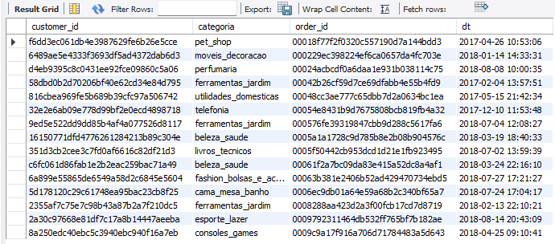
</p>
  
- Usei janelas com `LAG()` particionando por `(cliente, categoria)` para recuperar a compra anterior.
- Calculei `DATEDIFF(dt, dt_prev)` e agreguei por categoria (média e contagem de intervalos).

```sql
WITH compras AS (
  SELECT DISTINCT o.customer_id,
                  p.product_category_name AS categoria,
                  o.order_id, o.order_purchase_timestamp AS dt
  FROM olist_orders o
  JOIN olist_order_items oi ON oi.order_id   = o.order_id
  JOIN olist_products p ON p.product_id  = oi.product_id
  WHERE o.order_status = 'delivered'
    AND p.product_category_name IS NOT NULL
),
data_anterior AS (
  SELECT customer_id,
         categoria,
         order_id, dt,
    	 LAG(order_id) OVER (PARTITION BY customer_id, categoria ORDER BY dt) AS order_prev,
         LAG(dt) OVER (PARTITION BY customer_id, categoria ORDER BY dt) AS dt_prev
  FROM compras
)
SELECT
  categoria,
  ROUND(AVG(DATEDIFF(dt, dt_prev)), 2) AS media_dias_recompra_categoria,
  COUNT(*) AS n_intervalos
FROM data_anterior
WHERE dt_prev IS NOT NULL
  AND order_id <> order_prev
GROUP BY categoria 
ORDER BY media_dias_recompra_categoria ASC;
```

### Resultado
- Ao checar `COUNT(DISTINCT order_id)` por `(cliente, categoria)`, não há pares com 2+ pedidos distintos após os filtros (`order_status = 'delivered'` e categorias não nulas).
- Resultado: nenhuma categoria apresenta recompra observável nessa configuração do dataset.

<p align="center">
  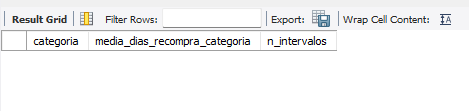
</p>

### Interpretação
- No recorte utilizado, o Olist mostra alta proporção de clientes de 1ª compra por categoria.
- Itens repetidos no mesmo pedido não são “recompra” e foram corretamente ignorados.

## Qual o tempo médio, máximo e mínimo entre a data de realização do pedido e aprovação do pagamento, por meios de pagamento+

Essa análise busca identificar quanto tempo (em dias) cada **método de pagamento** leva entre o momento da compra (`order_purchase_timestamp`) e a sua aprovação (`order_approved_at`).  
Esse tipo de métrica é útil para entender atrasos no processo de aprovação financeira.  

### Análise Exploratória e Qualidade dos Dados

Para realizar essa análise, precisei antes entender os possíveis: status de cada pedido, e os  tipos de pagamentos.

```sql
SELECT DISTINCT order_status
FROM olist_orders;
```
<p align="center">
  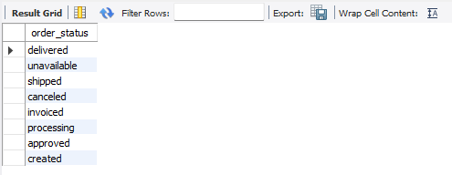
</p>

```sql
SELECT DISTINCT op.payment_type
FROM olist_data.olist_order_payments op;
```
<p align="center">
  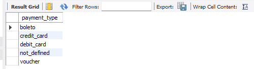
</p>

Assim, entendemos quais são os tipos de dados e as possíveis interpretações na query principal.

### Query utilizada:

O processo foi dividido em três etapas principais:

1. Filtrar os dados relevantes
   - Consideramos apenas pedidos entregues.  
   - Removemos os pagamentos inválidos (`not_defined`, `voucher`).  
   - Excluímos pedidos cancelados ou indisponíveis.  

2. Calcular a diferença entre as datas
   - Usamos a função `DATEDIFF` para medir o intervalo (em dias) entre a data da compra (`order_purchase_timestamp`) e a aprovação do pagamento (`order_approved_at`).  
   - Esse resultado foi armazenado em uma tabela temporária (`diff`) para facilitar a análise.  

3. Consolidar por tipo de pagamento
   - Para cada método de pagamento (`p_type`) calculamos:  
     - `AVG(diff_date)` → tempo médio de aprovação.  
     - `MIN(diff_date)` → tempo mínimo encontrado.  
     - `MAX(diff_date)` → tempo máximo encontrado.  
   - A ordenação foi feita pelo maior tempo máximo (`ORDER BY max_diff DESC`) para destacar os casos mais críticos.  

Dessa forma conseguimos identificar quais métodos de pagamento aprovam mais rápido e quais demoram mais.
    
```sql
 WITH order_type 
AS(
SELECT     op.order_id, 
           op.payment_type AS p_type, 
	       od.order_purchase_timestamp AS purchase, 
		   od.order_approved_at        AS approved 
FROM       olist_data.olist_order_payments op
INNER JOIN olist_orders od
ON   	   od.order_id = op.order_id
WHERE 	   op.payment_type NOT IN ('not_defined','voucher')
AND        od.order_status NOT IN ('canceled','unavailable')
), diff 
AS(
SELECT    p_type, 
		   DATEDIFF(approved,purchase) AS diff_date
FROM       order_type
)
SELECT     d.p_type, 
	       ROUND(AVG(d.diff_date)) AS avg_dif,
           MAX(d.diff_date)        AS max_diff,
           MIN(d.diff_date)        AS min_diff
FROM       diff d
GROUP BY   d.p_type
ORDER BY   max_diff DESC;
```
### Resultado

Assim, obtemos o resultado abaixo:

<p align="center">
  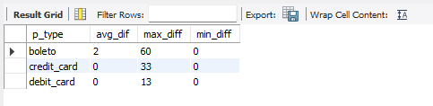
</p>

* Cartão (crédito e débito): métodos mais confiáveis e rápidos, praticamente instantâneos.
* Boleto: gera maior atraso médio e alta variabilidade no tempo de aprovação.
* Negócio: incentivar pagamentos via cartão (promoções ou parcelamento sem juros) pode reduzir o tempo de processamento e melhorar a experiência do cliente, enquanto o boleto, apesar de inclusivo, aumenta a lentidão operacional.

## Qual o ticket médio, máximo e mínimo dos pedidos?

Para entender melhor o valor dos pedidos realizados na Olist, foi feita uma análise considerando todos os pagamentos por pedido.  
Como visto previamente que alguns pedidos podem ter mais de um pagamento (parcelas ou diferentes métodos), foi necessário realizar a soma dos valores por `order_id` antes de calcular as estatísticas.

- `AVG` → retorna o valor médio dos pedidos (ticket médio).  
- `MAX` → retorna o maior valor encontrado em um pedido.  
- `MIN` → retorna o menor valor encontrado em um pedido.  
- O filtro `WHERE valores != 0` garante que não sejam considerados pedidos sem pagamento.
  
### Query utilizada:

```sql
WITH valor AS (
  SELECT op.order_id, SUM(op.payment_value) AS valores
  FROM olist_order_payments op
  GROUP BY op.order_id
)
SELECT 
  ROUND(AVG(valores),2) AS avg_payments,
  MAX(valores) AS max_payments,
  MIN(valores) AS min_payments
FROM valor
WHERE valores != 0;
```
### Resultado

Rodando a query, obtemos as seguintes informações:

<p align="center">
  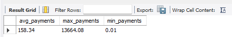
</p>

## Quanto tempo em média leva para um pedido ser entregue?

### Análise Exploratória e Qualidade dos Dados

Antes de simplesmente realizar a query, precisamos entender os dados e quais estão corretos.
Para isso correlacionei os seguintes dados em um filtro de `SELECT DISTINCT order status`, `order_delivered_carrier_date`, `order_delivered_customer_date`, `order_estimated_delivery_date`. 
Onde esses dados não são nulos, ou seja, possuem uma data de entrega para cada etapa do pedido.

```sql
SELECT DISTINCT order_status
FROM olist_orders
WHERE order_delivered_carrier_date IS NOT NULL
  OR order_delivered_customer_date IS NOT NULL
  OR order_estimated_delivery_date IS NOT NULL;
```
<p align="center">
  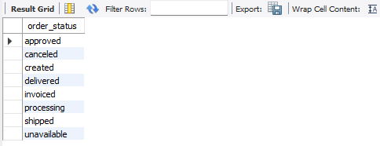
</p>

Feito isso, temos o resultado acima e logo entedemos que precisamos excluir alguns dados filtrando pelo status.

### Query utilizada:

Sendo assim, criamos uma tabela de dados com a query inicial que calcula a diferença entre datas, `order_purchase_timestamp` e `order_delivered_customer_date`.
```sql
WITH datas AS (
SELECT 
	   DATEDIFF(order_delivered_customer_date,order_purchase_timestamp) AS diff
FROM   olist_orders
WHERE  order_delivered_customer_date IS NOT NULL
  AND  order_purchase_timestamp IS NOT NULL
  AND  order_status NOT IN ('canceled','unavailable')
)
SELECT ROUND(AVG(diff)) AS avg_delivered_date
FROM   datas;
```
### Resultado

Por fim, o resultado no mostra uma média de 12 dias desde a data de efetivação por parte do cliente o pedido, até a confirmação do pedido entregue no endereço do consumidor.

<p align="center">
  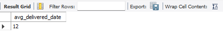
</p>

* Quanto tempo em média leva para um pedido ser entregue por categoria?

Seguindo o mesmo pensamento da query anterior, mas agora vamos fazer uma junção com a tabela `olist_products` e as categorias dos produtos filtrando por `order_id` e a tabela `olist_order_items`.

### Query utilizada:

```sql
WITH datas AS (
SELECT     op.product_category_name AS category,
	       DATEDIFF(od.order_delivered_customer_date,od.order_purchase_timestamp) AS diff
FROM  	   olist_orders od
INNER JOIN olist_order_items oi
	    ON oi.order_id   = od.order_id
INNER JOIN olist_products op
		ON oi.product_id = op.product_id
WHERE      order_delivered_customer_date IS NOT NULL
  AND      order_purchase_timestamp      IS NOT NULL
  AND      order_status NOT IN ('canceled','unavailable')
  AND      op.product_category_name <> ""
)
SELECT category, ROUND(AVG(diff)) AS avg_delivered_date
FROM datas
GROUP BY   category
ORDER BY   avg_delivered_date DESC
LIMIT 10;
```

### Resultado

Podemos observar que o primeiro item é "Moveis_escritorio", assim podemos interprertar que o prazo de entrega é maior devido ao produto precisar ser fabricado, ou o produto ter dimensões maiores causando um conflito na disponibilidade de entrega.

<p align="center">
  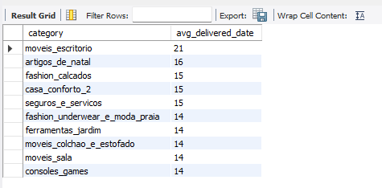
</p>

## Qual é a taxa de atraso na entrega?

### Lógica da Query  

Para calcular a taxa de atraso nas entregas, seguimos os passos abaixo:  

1. Comparação das datas  
   - `order_delivered_customer_date` (data real da entrega)  
   - `order_estimated_delivery_date` (data estimada de entrega)  

2. Definição de regra do que é atraso
   - Se `DATEDIFF(order_delivered_customer_date, order_estimated_delivery_date) > 0` → Pedido marcado como `1` (atrasado).  
   - Caso contrário → Pedido marcado como `0` (entregue no prazo).  

3. Construção da CTE (`atraso`)
   - Criamos uma tabela temporária onde cada linha recebe `is_late = 1` ou `is_late = 0`.  

4. Cálculo da média
   - Calculamos `AVG(is_late)`.  
   - Multiplicamos o resultado por 100 → percentual de pedidos atrasados.
     
### Query utilizada:

```sql
WITH atraso AS (
SELECT 
       CASE 
           WHEN DATEDIFF(order_delivered_customer_date, order_estimated_delivery_date) > 0 THEN 1
           ELSE 0
       END AS is_late
FROM olist_orders
WHERE order_delivered_customer_date IS NOT NULL
  AND order_estimated_delivery_date IS NOT NULL
  AND order_status NOT IN ('canceled','unavailable')
) 
SELECT 
       ROUND(AVG(is_late) * 100, 2) AS pct_late 
FROM atraso;
```
### Resultado

O resultado mostra a porcentagem de pedidos atrasados em relação ao total entregue.

Esse indicador é fundamental para avaliar:
* Eficiência logística da Olist.
* Impacto no nível de serviço (SLAs de entrega).
* Possíveis melhorias na previsão de prazos e na operação de transporte.

<p align="center">
  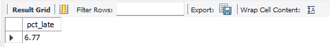
</p>

# Olist Sales Dashboard — Power BI

Análise de vendas e experiência do usuário com o dataset público **Olist** (Kaggle).  
Foco: receita por estado/ano/categoria, métodos de pagamento, ticket médio e distribuição de reviews.

> Aviso: dashboard não oficial, para fins educacionais. Fonte dos dados: Olist — Brazilian E-commerce Public Dataset (Kaggle).

## Visão Geral
- Stack: Power BI (modelagem e DAX), MySQL (ingestão/queries), GitHub Pages (publicação).
- Destaques:
  - Top 5 categorias **dinâmico** por contexto (estado/ano).
  - Medidas de **% de reviews por nota** com `DIVIDE` + `ALL`.
  - Tratamento de duplicidade via grão `(cliente, categoria, pedido, data)`.

## Perguntas de Negócio
- Quais estados/categorias mais vendem?
- Como evolui o ticket médio por ano?
- Como se distribuem as notas de review (1–5)?
- Qual o tempo médio de entrega?
- [Exploratória] Recompra por categoria: no recorte usado, 0 intervalos observáveis (alta proporção de primeira compra).

## Prints

Visualização abaixo do Dashboard Vendas:

<p align="center">
  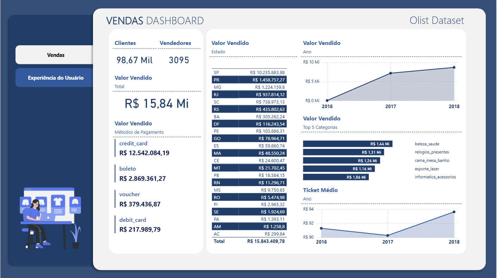
</p>

Visualização abaixo do Dashboard Experiência do Usuário:

<p align="center">
  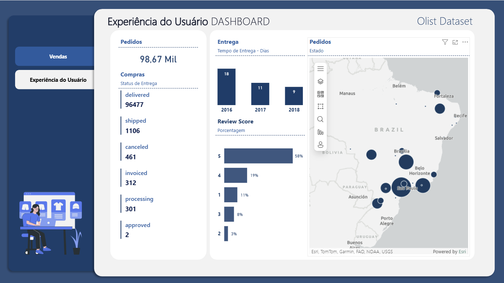
</p>

# Conclusão Geral

## Conclusão do Projeto

Este projeto teve como objetivo estruturar e analisar o Conjunto de Dados Públicos de E-commerce da Olist, disponível no Kaggle, aplicando conceitos de SQL para exploração, tratamento e análise de dados e Dashboard com a ferramenta Power BI.  

Durante o desenvolvimento:  
- Criamos um banco de dados relacional no MySQL a partir dos arquivos CSV.  
- Estruturamos as tabelas com chaves primárias e relacionamentos para dar suporte às consultas analíticas.  
- Realizamos queries exploratórias e avançadas, respondendo perguntas de negócio relevantes como:  
  - Quais categorias tiveram maior e menor volume de vendas?  
  - Qual o tempo médio de entrega dos pedidos?  
  - Qual a taxa de atraso na entrega?  
  - Qual o ticket médio das compras?  
  - Quais padrões de recompra podem ser identificados?  
- Aplicamos técnicas como CTEs, agregações, funções de data e janelas para consolidar métricas.  
- Geramos visuais complementares em dashboards (Power BI/Tableau).

### Principais insights
- Cartão de crédito e débito → aprovação praticamente imediata.  
- Boletos → apresentaram maior atraso médio e alta variabilidade.  
- O tempo médio de entrega foi de aproximadamente 9 dias, variando entre categorias e anos.  
- A taxa de atraso evidenciou que cerca de 6,77% dos pedidos chegaram após o prazo estimado, mostrando pontos de melhoria na logística.  

## Conclusão Dashboard

O dashboard consolida a visão de vendas da base pública da Olist, evidenciando:
- Forte concentração de receita em poucos estados (com São Paulo liderando).
- Predominância do cartão de crédito como método de pagamento.
- As categorias Top 5 variam conforme o contexto (estado/ano).
- O ticket médio mostra oscilação ao longo do período com tendência de melhora no último ano analisado.
- Na experiência do usuário, a distribuição das notas de review ajuda a identificar satisfação e pontos de atenção, onde 58% estão avaliando em 5 de nota.
- Um achado importante de qualidade/escopo de dados: ao medir recompra por categoria, não houve intervalos observáveis no recorte utilizado (pedidos “delivered” e categorias válidas), sugerindo alta proporção de primeiras compras por categoria. 

###  Considerações finais
O estudo demonstrou como SQL pode ser usado para responder perguntas reais de negócio e gerar indicadores estratégicos.  
Além disso, reforça a importância da integração entre análise de dados, modelagem estatística e visualização, criando um portfólio sólido para projetos de Data Analytics.  
